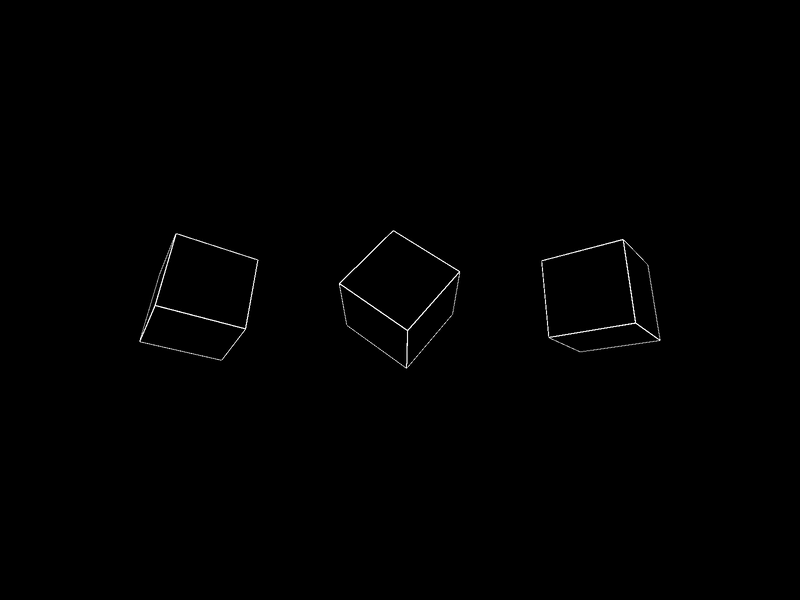

# opal-p5rb
Ruby bindings to P5.js via Opal

## Purpose

There are several projects aiming to create bindings between the P5.js lib and Ruby, with varying degrees of success.  While it has been proven to be easy enough to map static P5 functions and top-level variables to rb using Opal, I wanted to also be able to instantiate P5 classes (e.g. p5.Vector) and use those objects in the rb context.  The currently incomplete step in this process, is finding a way to access P5 members methods on instances of P5 objects in the rb context (see `call_p5_method()`.  As of now, I can only instantiate them and pass around the references.  For many sketches, this may not be an issue.

### Progress

- [x] P5 global constants

- [x] P5 mutable globals

- [x] P5 static functions

- [x] P5 class instantiation

- [ ] P5 instance members

- [ ] P5 instance methods

### Usage

Create your sketch in `sketch.rb` or in a new file which you include.  Then launch a local server from the working directory (e.g. `python -m http.server`).

_js console errors will appear for any event functions that you don't define in your sketch, e.g. mouseMoved()_

### Example Sketch _(in src at ./sketch.rb)_



```ruby
class Box
  def initialize(position, rotation_speed)
    @position = position
    @rotation = P5::Vector.new
    @rotation_speed = rotation_speed
  end

  def update
    @rotation.x += @rotation_speed.x
    @rotation.y += @rotation_speed.y
  end

  def display
    P5.push()
    P5.translate(@position.x, @position.y, @position.z)
    P5.rotateX(@rotation.x)
    P5.rotateY(@rotation.y)
    P5.stroke(255)
    P5.fill(0)
    P5.box(80)
    P5.pop()
  end
end

def setup
  P5.createCanvas(800, 600, P5.WEBGL)
  @boxes = []
  box_spacing = 200
  initial_x = -box_spacing
  3.times do
    pos = P5::Vector.new(initial_x, 0, 0)
    rotation_speed = P5::Vector.new(P5.random(0.005, 0.02), P5.random(0.005, 0.02), 0)
    @boxes << Box.new(pos, rotation_speed)
    initial_x += box_spacing
  end
end

def draw
  P5.background(0)
  @boxes.each do |box|
    box.update
    box.display
  end
end
```
